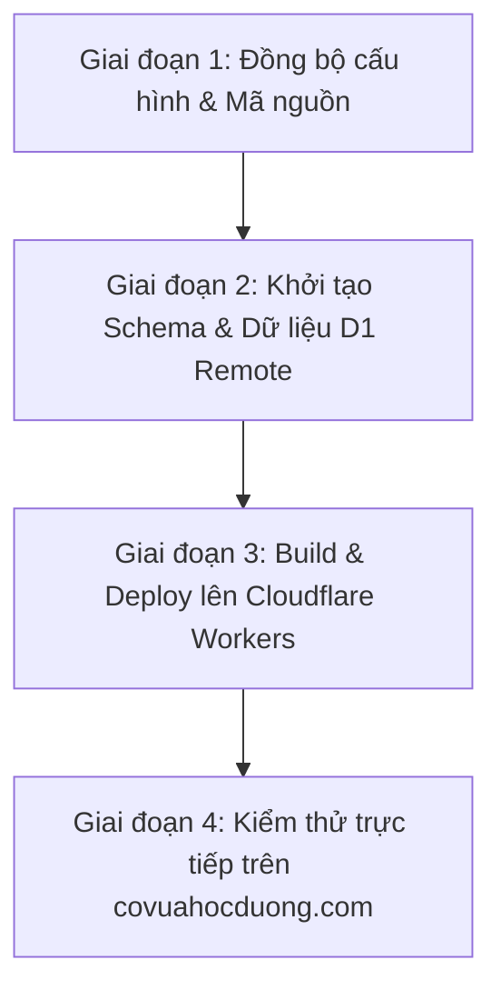

# Kế Hoạch Cập Nhật & Đồng Bộ Hệ Thống LMS Cho Website covuahocduong.com (Cloudflare)

## 1. Tổng Quan Mục Tiêu

Đồng bộ mã nguồn từ môi trường phát triển cục bộ lên hệ thống sản xuất **covuahocduong.com** đang chạy trên nền tảng **Cloudflare Workers** (kết hợp **Cloudflare D1 Database** và **R2 Storage**), kích hoạt đầy đủ tính năng **Hệ thống Quản lý Học tập (LMS)** ở chế độ `"full"` (Bán lẻ khóa học + Gói hội viên định kỳ).

---

## 2. Thông Tin Hạ Tầng Sản Xuất (Production Target)

- **Tên dự án Cloudflare Worker**: `covuahocduong`
- **Cloudflare D1 Database**: `emdash_db` (ID: `ae446e38-3446-403a-a827-4e60f90fe9e7`)
- **Cloudflare R2 Bucket**: `emdash-media`
- **Gói quản lý triển khai**: `demos/cloudflare` (`@emdash-cms/demo-cloudflare`)

---

## 3. Các Giai Đoạn Triển Khai Chi Tiết

### Giai đoạn 1: Đồng bộ Cấu hình & Giao diện Triển khai (`demos/cloudflare`)

1. **Cập nhật Dependencies**:
   - Thêm `"emdash-lms": "workspace:*"` vào file [package.json](file:///D:/code/emdash/demos/cloudflare/package.json).
   - Đảm bảo các thư viện phụ thuộc (`@astrojs/cloudflare`, `emdash`, `@emdash-cms/plugin-chessfenpgn`, `@emdash-cms/plugin-forms`) tương thích hoàn toàn.
2. **Cập nhật `astro.config.mjs`**:
   - Tích hợp `lmsPlugin({ mode: "full", currency: { base: "VND", display: "VND", exchangeRate: 1 }, courses: { enabled: true, individualPurchase: true }, membership: { enabled: true }, checkout: { enabled: true, providers: ["sepay", "stripe"] } })` vào danh sách `plugins` của EmDash.
   - Thêm integration `lmsIntegration({ layout: "./src/layouts/Layout.astro", basePath: "", styles: "plugin" })`.
3. **Đồng bộ Giao diện (Navigation & Hero Banner)**:
   - Thêm mục menu `Khóa học Online` (`/courses`) và `Gói Hội Viên` (`/plans`) vào [Header.astro](file:///D:/code/emdash/demos/cloudflare/src/components/Header.astro).
   - Cập nhật [index.astro](file:///D:/code/emdash/demos/cloudflare/src/pages/index.astro) để hiển thị banner giới thiệu nền tảng học cờ vua trực tuyến và liên kết tới danh mục khóa học.
   - Đảm bảo [Layout.astro](file:///D:/code/emdash/demos/cloudflare/src/layouts/Layout.astro) chứa đầy đủ cấu trúc meta, header, footer và slot cho các trang LMS tự động inject.

---

### Giai đoạn 2: Cập Nhật Schema & Dữ Liệu Trên Cloudflare D1 Remote

1. **Tạo bảng LMS trên Cloudflare D1**:
   - Hệ thống EmDash tự động khởi tạo và đăng ký các bảng khi Worker khởi động (`ec_courses`, `ec_membership_plans`, `ec_course_categories`, `ec_modules`, `ec_lessons`, `ec_user_course_access`, `ec_user_membership_subscriptions`, `ec_lms_orders`).
2. **Nạp dữ liệu mẫu ban đầu (Seed Data)**:
   - Nạp các danh mục khóa học, khóa học mẫu (Cờ vua Căn bản, Chiến thuật Tầm trung, Khai cuộc hiện đại) và các gói hội viên (Tháng / Năm) lên D1 remote thông qua script nạp dữ liệu an toàn.

---

### Giai đoạn 3: Biên Dịch & Triển Khai (Build & Deploy)

1. **Kiểm tra TypeScript & Bundle SSR**:
   - Chạy lệnh `pnpm --filter @emdash-cms/demo-cloudflare build` để xác nhận việc biên dịch SSR cho Cloudflare Worker không gặp bất kỳ lỗi cú pháp hoặc thiếu biến môi trường.
2. **Deploy lên Cloudflare Workers**:
   - Chạy lệnh `wrangler deploy` từ thư mục `demos/cloudflare` để đưa phiên bản mới nhất lên domain sản xuất `covuahocduong.com`.

---

### Giai đoạn 4: Kiểm Thử Nghiệm Thu Trực Tiếp (Production Smoke Testing)

1. **Trang Chủ**: Truy cập `https://covuahocduong.com/`, kiểm tra menu điều hướng mới và banner Khóa học trực tuyến.
2. **Danh mục Khóa học**: Truy cập `https://covuahocduong.com/courses`, kiểm tra hiển thị danh sách khóa học và bộ lọc.
3. **Trang Bảng giá Hội viên**: Truy cập `https://covuahocduong.com/plans`, kiểm tra các gói hội viên Tháng / Năm.
4. **Trang Chi tiết Khóa học & Bài học**: Truy cập `https://covuahocduong.com/course/...` và `https://covuahocduong.com/lesson/...`.
5. **Trang Thanh toán**: Truy cập `https://covuahocduong.com/checkout/...`, xác nhận hiển thị cổng SePay QR Code và Stripe.
