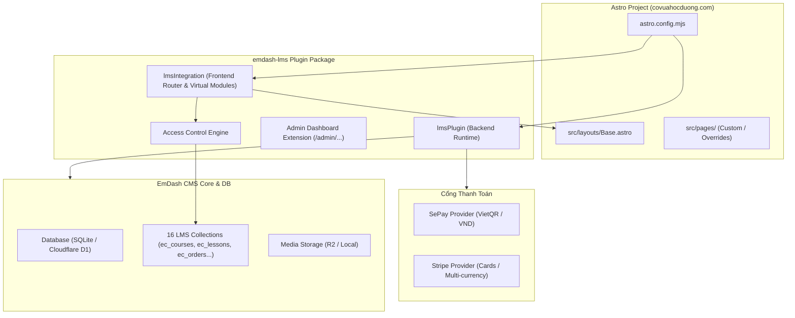

# Kế Hoạch Cài Đặt và Tích Hợp Plugin EmDash LMS Cho Website covuahocduong.com

## 1. Tổng Quan & Mục Tiêu

Tài liệu này phân tích, đánh giá và lập kế hoạch kỹ thuật chi tiết để tích hợp plugin **`emdash-lms`** (nguồn: [https://github.com/tohaitrieu/emdash-lms](https://github.com/tohaitrieu/emdash-lms)) vào nền tảng website **covuahocduong.com** (Cờ Vua Học Đường) chạy trên nền tảng **EmDash CMS** và **Astro**.

### Mục tiêu cốt lõi:

1. **Hệ thống Đào tạo & Khóa học Cờ vua (LMS)**: Quản lý các cấp độ học cờ (Cơ bản, Khai cuộc, Trung cuộc, Tàn cuộc, Chiến thuật) với bài học đa phương tiện, video, lý thuyết và câu đố/bài tập tương tác.
2. **Gói Hội viên (Membership / Subscriptions)**: Hỗ trợ các gói đăng ký định kỳ (Tháng, Quý, Năm, Trọn đời / VIP) để mở khóa toàn bộ kho tài liệu và bài giảng.
3. **Thanh toán Nội địa Tối ưu (SePay QR Bank Transfer / VND)**: Tích hợp cổng thanh toán SePay quét mã VietQR tự động kích hoạt tài khoản ngay sau khi chuyển khoản, cùng tùy chọn Stripe cho thanh toán quốc tế.
4. **Tích hợp Hệ sinh thái Cờ vua**: Kết hợp các khối hiển thị bàn cờ FEN/PGN (`@emdash-cms/plugin-chessfenpgn`) trực tiếp trong nội dung bài giảng của LMS.

---

## 2. Đánh Giá & Phân Tích Kỹ Thuật Plugin `emdash-lms`

### 2.1. Kiến trúc Plugin



### 2.2. Các Bộ Sưu Tập Dữ Liệu (16 Collections trong `seed.json`)

Plugin cung cấp sẵn bộ lược đồ dữ liệu hoàn chỉnh, chuẩn hóa cho mô hình CMS:

| Nhóm chức năng            | Tên Collection          | Mục đích                                                                  |
| :------------------------ | :---------------------- | :------------------------------------------------------------------------ |
| **Gói Hội Viên**          | `membership_plans`      | Định nghĩa các gói: Tên gói, giá, chu kỳ thanh toán, quyền lợi, giới hạn  |
|                           | `memberships`           | Hồ sơ gói hội viên của từng user, ngày bắt đầu, ngày hết hạn, trạng thái  |
| **Khóa Học & Bài Học**    | `course_categories`     | Danh mục: Khai cuộc, Tàn cuộc, Chiến thuật, Cờ tàn thực chiến             |
|                           | `courses`               | Khóa học: Cấp độ, điều kiện tiên quyết, giá mua lẻ, yêu cầu gói hội viên  |
|                           | `modules`               | Chương/Học phần trong khóa học                                            |
|                           | `lessons`               | Bài học chi tiết: PortableText, video URL, thời lượng, xem trước miễn phí |
| **Kiểm Tra & Câu Đố**     | `quizzes`               | Bài trắc nghiệm/bài tập cờ vua, điểm qua môn, thời gian làm bài           |
|                           | `questions`             | Câu hỏi (trắc nghiệm, điền thế cờ), đáp án, giải thích nước đi            |
|                           | `quiz_submissions`      | Lịch sử làm bài thi của học viên, điểm số, kết quả đạt/không đạt          |
| **Tiến Độ & Chứng Chỉ**   | `enrollments`           | Ghi danh khóa học, % tiến độ hoàn thành                                   |
|                           | `lesson_progress`       | Tiến độ từng bài học, đánh dấu đã hoàn thành                              |
|                           | `certificate_templates` | Mẫu phôi chứng chỉ hoàn thành khóa học (SVG/HTML)                         |
|                           | `certificates`          | Chứng chỉ đã cấp phát kèm mã định danh duy nhất                           |
| **Thương Mại & Đơn Hàng** | `orders`                | Lịch sử đơn hàng, số tiền, mã giảm giá, trạng thái thanh toán             |
|                           | `coupons`               | Mã khuyến mãi, giảm % hoặc số tiền cố định, giới hạn lượt dùng            |
|                           | `course_reviews`        | Đánh giá & nhận xét khóa học từ học viên                                  |

### 2.3. Đánh Giá Ưu Điểm & Thách Thức

#### Ưu Điểm:

- **Tương thích hoàn hảo với EmDash**: Plugin được viết chuyên biệt cho hệ sinh thái EmDash CMS & Astro, tuân thủ kiến trúc Kysely SQL tables + Astro SSR endpoints.
- **Hỗ trợ sẵn SePay (Việt Nam)**: Đã có sẵn provider `sepayProvider` xử lý webhook và xác thực giao dịch chuyển khoản ngân hàng bằng mã đối soát `LMS-XXXXXXXX`.
- **Hệ thống Access Control 4 cấp**:
  1. _Free_: Bài học/khóa học miễn phí.
  2. _Preview_: Bài học cho phép xem thử (dù khóa học có tính phí).
  3. _Membership_: Truy cập dựa trên gói hội viên còn hạn.
  4. _Individual Purchase_: Mua đứt khóa học trọn đời.
- **Frontend Astro Injected Pages**: Cung cấp sẵn các trang chuẩn (`/courses`, `/course/[slug]`, `/lesson/[slug]`, `/plans`, `/checkout/[id]`) với khả năng ghi đè linh hoạt qua `src/pages/`.

#### Điểm Cần Tùy Biến Cho `covuahocduong.com`:

- **Tiền tệ & Định dạng**: Chuyển đổi định dạng giá mặc định sang **VND (đ)**.
- **Bàn cờ Tương tác**: Đảm bảo các bài học cờ vua có thể nhúng các component bàn cờ tương tác PGN/FEN (sử dụng plugin `@emdash-cms/plugin-chessfenpgn`).
- **Giao diện & Ngôn ngữ**: Việt hóa 100% các nhãn, thông báo, nút bấm từ tiếng Anh sang tiếng Việt.

---

## 3. Lộ Trình Triển Khai Chi Tiết (6 Giai Đoạn)

### Giai đoạn 1: Cài đặt Dependency & Cấu hình Plugin Backend

1. **Cài đặt package**:

   ```bash
   pnpm add emdash-lms
   ```

   _(Hoặc clone / link cục bộ vào workspace monorepo nếu cần chỉnh sửa mã nguồn plugin)_.

2. **Cập nhật `astro.config.mjs`**:
   ```typescript
   import { defineConfig } from "astro/config";
   import emdash from "emdash/astro";
   import { lmsPlugin } from "emdash-lms";
   import { lmsIntegration } from "emdash-lms/astro";

   export default defineConfig({
   	integrations: [
   		emdash({
   			plugins: [
   				lmsPlugin({
   					mode: "full",
   					currency: {
   						base: "VND",
   						display: "VND",
   						exchangeRate: 1,
   					},
   					courses: {
   						enabled: true,
   						individualPurchase: true,
   					},
   					membership: {
   						enabled: true,
   					},
   					checkout: {
   						enabled: true,
   						providers: ["sepay", "stripe"],
   					},
   				}),
   			],
   		}),
   		lmsIntegration({
   			layout: "./src/layouts/Base.astro",
   			basePath: "",
   			styles: "theme", // Kế thừa token & biến màu từ giao diện covuahocduong.com
   		}),
   	],
   });
   ```

---

### Giai đoạn 2: Khởi Tạo Schema Dữ Liệu & Seed Khóa Học Mẫu

1. **Nạp Seed Data vào EmDash Database**:
   - Sử dụng `emdash-lms/seed/seed.json` để tạo 16 bảng dữ liệu `ec_membership_plans`, `ec_courses`, `ec_lessons`, v.v.
   - Chạy lệnh khởi tạo / sync schema qua EmDash CLI:
     ```bash
     pnpm emdash seed node_modules/emdash-lms/seed/seed.json
     ```

2. **Thiết lập danh mục & khóa học cờ vua mẫu**:
   - **Danh mục**:
     - _Nhập môn Cờ vua (Cho người mới bắt đầu & học sinh tiểu học)_
     - _Chiến thuật & Đòn phối hợp căn bản_
     - _Khai cuộc căn bản & Bẫy khai cuộc_
     - _Cờ tàn căn bản_
   - **Gói Hội viên**:
     - _Gói Cơ Bản (Tháng)_: Truy cập tất cả bài giảng nhập môn & chiến thuật.
     - _Gói Nâng Cao (Năm)_: Toàn bộ khóa học + bài tập tương tác + chứng chỉ.
     - _Gói VIP Học Đường_: Kèm quyền tham gia giải đấu nội bộ & phân tích ván đấu.

---

### Giai đoạn 3: Cấu Hình Cổng Thanh Toán SePay (VietQR)

1. **Thiết lập biến môi trường**:

   ```env
   # SePay Credentials (cho covuahocduong.com)
   SEPAY_API_KEY="your_sepay_api_token"
   SEPAY_CHECKOUT_URL="https://my.sepay.vn/pay/..."
   SEPAY_WEBHOOK_SECRET="your_webhook_secret"
   ```

2. **Cấu hình Webhook SePay**:
   - URL Webhook tiếp nhận trên website:
     `https://covuahocduong.com/_emdash/api/plugins/lms/webhook/sepay`
   - Kiểm thử luồng:
     1. Khách hàng chọn gói cờ vua / khóa học -> Chuyển đến trang thanh toán.
     2. Hiển thị mã QR VietQR với nội dung chuyển khoản `LMS-XXXXXX`.
     3. Khách quét mã trên ứng dụng ngân hàng và chuyển tiền.
     4. SePay bắn Webhook về website -> Hệ thống tự động tạo `enrollment` hoặc kích hoạt `membership`.

---

### Giai đoạn 4: Tích Hợp Bàn Cờ Cờ Vua PGN / FEN Vào Bài Học

1. **Kết nối Block Bàn cờ trong PortableText**:
   - Đảm bảo trong trình soạn thảo bài học (`lessons.content`), giảng viên có thể chèn block bàn cờ PGN/FEN thông qua `@emdash-cms/plugin-chessfenpgn`.
2. **Trình phát bài học (`/lesson/[slug]`)**:
   - Render bài học với video hướng dẫn phía trên.
   - Bàn cờ động phía dưới cho phép học viên tự di chuyển quân hoặc xem danh sách nước đi (Move list).

---

### Giai đoạn 5: Tùy Biến Giao Diện (Theme & Localization)

1. **CSS Variables cho Theme Cờ Vua**:
   ```css
   :root {
   	--lms-accent: #1e3a8a; /* Xanh Navy học đường */
   	--lms-accent-hover: #172554;
   	--lms-radius: 0.5rem;
   	--lms-container-width: 1240px;
   	--lms-font-family: inherit;
   }
   ```
2. **Việt hóa toàn diện**:
   - Tạo bộ từ điển tiếng Việt cho các trang LMS: "Khóa học", "Bài học tiếp theo", "Hoàn thành bài học", "Đăng ký gói", "Thanh toán", "Nhận chứng chỉ".

---

### Giai đoạn 6: Kiểm Thử & Nghiệm Thu (Verification Plan)

#### 6.1. Kiểm thử tự động (Automated Testing)

- Chạy kiểm tra TypeScript typecheck:
  ```bash
  pnpm typecheck
  ```
- Kiểm tra cú pháp và định dạng:
  ```bash
  pnpm lint:quick
  pnpm format
  ```
- Chạy unit tests cho luồng kiểm tra quyền truy cập `checkCourseAccess`:
  ```bash
  pnpm test
  ```

#### 6.2. Kiểm thử thủ công (Manual Verification)

1. **Kiểm tra quyền truy cập (Access Control)**:
   - Truy cập bài học miễn phí/xem trước -> Xem bình thường khi chưa đăng nhập.
   - Truy cập bài học tính phí -> Bị chặn và hiển thị yêu cầu nâng cấp gói hoặc mua khóa học.
2. **Kiểm tra luồng thanh toán SePay**:
   - Tạo đơn hàng mua gói hội viên cờ vua.
   - Quét mã QR thanh toán thử nghiệm.
   - Xác nhận webhook SePay kích hoạt trạng thái `completed` và tài khoản học viên có quyền truy cập ngay lập tức.
3. **Kiểm tra bài tập trắc nghiệm & Cấp chứng chỉ**:
   - Học viên hoàn thành 100% bài học và đạt điểm bài test -> Hệ thống sinh chứng chỉ PDF/SVG với tên học viên và mã xác thực.

---

## 4. Tóm Tắt & Các Câu Hỏi Làm Rõ (Open Questions)

> [!IMPORTANT]
> **Điểm cần xác nhận với người dùng trước khi triển khai:**
>
> 1. **Chế độ hoạt động (LMS Mode)**: Bạn muốn sử dụng chế độ kết hợp **"full"** (vừa bán gói hội viên tháng/năm, vừa bán lẻ từng khóa học cờ vua) hay chỉ đơn thuần **"membership"** hoặc **"lms"**?
> 2. **Nguồn package `emdash-lms`**: Bạn muốn cài đặt `emdash-lms` từ registry npm công khai hay clone mã nguồn từ `https://github.com/tohaitrieu/emdash-lms` vào thư mục `packages/plugins/emdash-lms` trong monorepo hiện tại để tiện tùy chỉnh sâu?
> 3. **Cổng thanh toán ưu tiên**: Đơn vị có sẵn tài khoản **SePay (sepay.vn)** và số tài khoản ngân hàng nhận tiền chưa?
