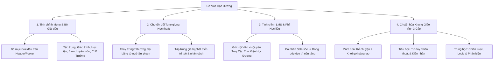

# Phương Án Định Hướng Học Thuật & Phi Thương Mại Hóa Cho Cờ Vua Học Đường (covuahocduong.com)

## 1. Tôn Chỉ & Định Vị Nền Tảng (Core Philosophy & Positioning)

Website **covuahocduong.com** được xác định là **Cổng Thông tin & Nền tảng Học liệu Cờ Vua Học Đường Chuẩn Quốc gia**:

- **Trọng tâm cốt lõi**: Nghiên cứu, chuẩn hóa khung giáo trình sư phạm cờ vua từ Mầm non đến Phổ thông; phát triển tư duy logic, tính tập trung, khả năng phản biện và rèn luyện nhân cách cho học sinh Việt Nam.
- **Phi thương mại hóa**: Loại bỏ các yếu tố tiếp thị bán hàng dồn dập (giảm giá sốc, flash sale, đồng hồ đếm ngược, từ ngữ thương mại nặng nề). Thay vào đó, định vị phần đóng góp tài chính như là **Học phí duy trì thư viện học liệu & Quỹ phát triển học thuật học đường**.
- **Tạm dừng thông tin giải đấu**: Toàn bộ nội dung về lịch thi đấu, cúp vô địch, giải đấu phong trào/trẻ quốc gia được tạm gỡ bỏ để dồn toàn bộ nguồn lực và diện mạo trang web cho công tác **giảng dạy, học liệu tương tác và phương pháp sư phạm**.

---

## 2. Chi Tiết Phương Án Điều Chỉnh (Implementation Strategy)

---

## 3. Các Hạng Mục Thực Hiện Cụ Thể

### 🔹 Hạng mục 1: Tinh chỉnh Hệ thống Menu & Loại bỏ Giải đấu

1. **Header Navigation (`Header.astro`)**:
   - Gỡ bỏ mục `Giải đấu` (`/lich-khai-giang`).
   - Cấu trúc menu chuẩn học thuật:
     - `Trang chủ` (`/`)
     - `Khung giáo trình` (`/dao-tao`)
     - `Khóa học & Chuyên đề` (`/courses`)
     - `Thư viện Học đường` (`/plans`)
     - `CLB Trường học` (`/co-so`)
     - `Ban chuyên môn` (`/huan-luyen-vien`)
     - `Tài liệu & Nghiên cứu` (`/blog`)
     - `Liên hệ Học đường` (`/lien-he`)
   - Nút CTA góc phải: Đổi thành `"Đồng hành cùng Nhà trường"` hoặc `"Đăng ký CLB Trường"`.
2. **Xử lý trang `lich-khai-giang.astro`**:
   - Chuyển hướng hoặc thay thế nội dung từ "Lịch giải đấu" sang **"Khung Kế Hoạch Năm Học & Sinh Hoạt CLB Học Đường"** (lịch phân phối chương trình 36 tuần theo năm học của Bộ GD&ĐT).

---

### 🔹 Hạng mục 2: Tái cấu trúc Nội dung Trang Chủ (`index.astro`)

1. **Hero Section**:
   - Nhấn mạnh: _"Khung giáo trình cờ vua chuẩn mực — Phát triển năng lực tư duy cho thế hệ trẻ"_.
   - Chỉ số tin cậy: Đổi từ "Quy mô giải đấu" sang _"Chương trình tích hợp ngoại khóa & tiết học thể chất trí tuệ tại các trường học"_.
2. **Khối 3 Cấp độ Giáo dục**:
   - **Mầm non (3–5 tuổi)**: Phương pháp nhân cách hóa quân cờ, chuyện kể cờ vua, nhận biết hình học và quy luật cơ bản.
   - **Tiểu học (6–11 tuổi)**: Rèn luyện tính kiên nhẫn, khả năng tập trung, bài tập đòn phối hợp và văn hóa bắt tay tôn trọng đối thủ.
   - **Trung học (12–18 tuổi)**: Tư duy chiến lược, phân tích logic, quy nạp - diễn dịch và kiểm soát cảm xúc.
3. **Khối Học thuật & Ban Chuyên Môn**:
   - Đưa hình ảnh các nhà giáo, huấn luyện viên có bằng cấp sư phạm, đại kiện tướng với vai trò **Hội đồng Thẩm định Chuyên môn** hỗ trợ nhà trường.

---

### 🔹 Hạng mục 3: Tinh chỉnh Hệ thống LMS theo Hướng Thư Viện Học Đường

1. **Trang Danh mục Khóa học (`/courses`)**:
   - Tiêu đề: **Kho Học Liệu & Chuyên Đề Cờ Vua Học Đường**.
   - Mô tả: Hệ thống bài giảng video, sơ đồ tư duy và thế cờ tương tác phục vụ học sinh tự học và giáo viên làm giáo cụ trực quan.
2. **Trang Quyền Truy Cập Thư Viện (`/plans`)**:
   - Thay đổi khái niệm "Gói thương mại / Bán gói" thành **"Phí Đồng Hành & Quyền Truy Cập Thư Viện Học Tập"**:
     - _Thẻ Học Kỳ (Kỳ I / Kỳ II)_: Đồng hành học tập suốt 1 kỳ học.
     - _Thẻ Niên Học (1 Năm học)_: Hỗ trợ học sinh học tập toàn diện cả năm học kèm tài liệu in PDF.
     - _Thư Viện Trường Học / Tài khoản Trường_: Dành cho các thầy cô chủ nhiệm CLB cờ vua tại trường sử dụng giảng dạy tập thể.
   - Loại bỏ các huy hiệu "Sale 30%", "Giảm giá sốc" để giữ trọn vẹn tính chất trang nghiêm của giáo dục.
3. **Trang Chi tiết Khóa học & Bài học (`/course/[slug]`, `/lesson/[slug]`)**:
   - Tập trung vào tính tương tác: Bàn cờ động, câu hỏi tư duy sau bài học, phân tích nước đi sai thường gặp của học sinh.

---

### 🔹 Hạng mục 4: Tinh chỉnh Trang CLB Trường Học & Ban Chuyên Môn

1. **Trang `co-so.astro` (CLB Trường học)**:
   - Tập trung vào mô hình chuyển giao mô hình CLB cờ vua học đường cho Ban giám hiệu và thầy cô phụ trách Đoàn - Đội / Thể chất.
   - Hướng dẫn thành lập CLB cờ vua trường học, quy chế sinh hoạt hàng tuần, bộ giáo án mẫu 36 tuần.
2. **Trang `huan-luyen-vien.astro` (Ban Chuyên môn)**:
   - Nhấn mạnh tiêu chuẩn chuyên môn sư phạm, kinh nghiệm đào tạo trẻ em và sự tận tâm, chuẩn mực chuẩn nhà giáo.

---

## 4. Kế Hoạch Triển Khai Kỹ Thuật

1. **Bước 1: Cập nhật Components & Pages** trong cả 2 demo (`demos/cloudflare` và `demos/dsc-edu-vn`):
   - `Header.astro` & `Footer.astro`: Cập nhật lại danh mục điều hướng.
   - `index.astro`: Lọc bỏ các từ khóa giải đấu, chỉnh sửa banner và khối nội dung sư phạm.
   - `dao-tao.astro`, `co-so.astro`, `huan-luyen-vien.astro`: Làm sạch các nội dung giải đấu thành tích.
   - `plans.astro`, `courses.astro`, `checkout/[id].astro`: Điều chỉnh từ ngữ LMS sang phong cách thư viện học tập học đường.
2. **Bước 2: Cập nhật Dữ liệu D1 Database Remote**:
   - Cập nhật tên các gói hội viên và khóa học trên remote D1 (`emdash_db`) tương ứng với định hướng mới.
3. **Bước 3: Biên dịch & Kiểm tra Lint**:
   - `pnpm lint:quick` và `pnpm --filter @emdash-cms/demo-cloudflare build`.
4. **Bước 4: Deploy & Kiểm thử trên covuahocduong.com**:
   - `wrangler deploy` và nghiệm thu trực tiếp trên `https://covuahocduong.com/`.
