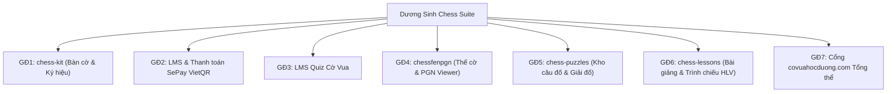

# Kế hoạch Tạo Dữ liệu Demo & Sổ tay Hướng dẫn Trải nghiệm Toàn bộ Tính năng Dương Sinh Chess Suite

## 1. Mục tiêu & Tổng quan

Tạo lập các dữ liệu demo mẫu hoàn chỉnh, trực quan cho toàn bộ 7 giai đoạn tính năng của hệ thống **Dương Sinh Chess Suite** trên `covuahocduong.com`. Cung cấp hướng dẫn chi tiết từng bước (User Guide & Walkthrough) để Thầy Tường và đội ngũ Huấn luyện viên có thể tự trải nghiệm, kiểm thử và hướng dẫn lại học sinh.

---

## 2. Danh mục Tính năng & Các Kịch bản Demo Chi tiết

---

### Giai đoạn 1: Thư viện Cờ Hạt nhân (`@duongsinh/chess-kit`)

- **Tính năng:**
  - Bàn cờ trực quan `ChessBoard`, hỗ trợ 2 chiều Trắng/Đen.
  - Chuyển đổi ký hiệu song ngữ: Việt (V, H, X, T, M) ↔ Quốc tế (K, Q, R, B, N).
  - Hệ thống lưu trữ tiến độ học tập 2 lớp (`duongsinh-chess:progress:v1`).
- **Dữ liệu Demo mẫu:**
  - Trang demo kiểm tra chuyển đổi ký hiệu và tương tác bàn cờ.
- **Hướng dẫn trải nghiệm:**
  - Cách kéo thả quân cờ, đổi góc nhìn bàn cờ, bật/tắt ký hiệu tiếng Việt.

---

### Giai đoạn 2: Quản lý Khóa học & Thanh toán SePay VietQR (`emdash-lms`)

- **Tính năng:**
  - Khóa học miễn phí (xem trực tiếp) & Khóa học tính phí (cần Thẻ Thư Viện hoặc ghi danh).
  - Thanh toán học phí / Thẻ Thư Viện bằng **VietQR** tự động qua SePay.
  - Quản lý đơn hàng & duyệt thủ công trong Admin khi học sinh chuyển khoản sai nội dung.
- **Dữ liệu Demo mẫu:**
  - 1 Thẻ Thư Viện mẫu: "Thẻ Thư Viện Học Đường 1 Tháng" (50.000 VNĐ).
  - 1 Khóa học tính phí: "Chiến thuật Nhập môn Cờ Vua" (150.000 VNĐ).
- **Hướng dẫn trải nghiệm:**
  - Vào `/plans` hoặc `/courses` -> Bấm Đăng ký -> Màn hình hiển thị mã QR VietQR kèm số tiền & mã `LMS-XXXXXXXX`.
  - Giả lập thanh toán qua Webhook hoặc duyệt tay trong Admin `/settings/orders`.

---

### Giai đoạn 3: Bài tập Trắc nghiệm Cờ Vua (`lms-quiz`)

- **Tính năng:**
  - Loại câu hỏi cờ thế (`type: "chess"`), chấm điểm tự động các nước đi hợp lệ phía server.
  - Giấu đáp án khi làm bài, hiển thị kết quả và giải thích chi tiết sau khi nộp bài.
- **Dữ liệu Demo mẫu:**
  - 1 Quiz mẫu: "Kiểm tra Chiến thuật Bắt Đôi & Chiếu Hết 1 Nước" (gồm 3 câu hỏi trắc nghiệm lý thuyết + 2 câu giải cờ thế tương tác).
- **Hướng dẫn trải nghiệm:**
  - Mở bài học có quiz -> Làm bài trực tiếp trên bàn cờ -> Bấm nộp bài -> Xem điểm số và đánh giá.

---

### Giai đoạn 4: Nhúng Thế cờ & Ván cờ PGN (`chessfenpgn`)

- **Tính năng:**
  - Khối `chess-fen`: Vẽ mũi tên chiến thuật (xanh lá, đỏ, vàng), tô màu ô cờ, chú thích.
  - Khối `chess-pgn`: Trình xem ván cờ PGN tương tác, danh sách nước đi phân nhánh, bình luận nước đi.
- **Dữ liệu Demo mẫu:**
  - 1 Bài viết blog demo: "Phân tích Ván cờ Bất hủ của Paul Morphy" (nhúng khối FEN có mũi tên tấn công và khối PGN toàn bộ ván đấu).
- **Hướng dẫn trải nghiệm:**
  - Xem bài viết -> Bấm từng nước đi trong danh sách PGN hoặc dùng phím mũi tên để xem diễn biến bàn cờ.

---

### Giai đoạn 5: Ngân hàng Câu đố Chiến thuật (`chess-puzzles`)

- **Tính năng:**
  - Kho câu đố phân theo 6 cấp độ (Tốt → Vua) và chủ đề chiến thuật tại `/cau-do`.
  - Trang giải câu đố `/cau-do/[slug]` có gợi ý, Elo, và nút chuyển câu tiếp theo.
  - Widget **Câu Đố Nổi Bật Trong Ngày** (`PuzzleOfTheDay`).
  - Bộ nhập hàng loạt Lichess CSV / EPD / PGN trong Admin.
- **Dữ liệu Demo mẫu:**
  - 6 câu đố đại diện cho 6 cấp độ cờ (Tốt, Mã, Tượng, Xe, Hậu, Vua) với các đòn: Bắt đôi, Ghim quân, Xiên, Chiếu thắt cổ, v.v.
- **Hướng dẫn trải nghiệm:**
  - Vào `/cau-do` -> Lọc theo cấp độ "Mã" -> Bấm vào giải câu đố -> Đi nước đúng/sai và xem phân tích.

---

### Giai đoạn 6: Bài giảng Tương tác & Trình chiếu Giảng dạy (`chess-lessons`)

- **Tính năng:**
  - Kịch bản bài giảng nhiều bước: Mỗi bước có thế cờ, mũi tên, lời giảng học sinh và ghi chú bảo mật cho HLV.
  - Trang chi tiết `/bai-giang/[slug]`.
  - Chế độ trình chiếu toàn màn hình `/bai-giang/[slug]/trinh-chieu` (phím tắt `←`/`→`, phím `B` làm tối màn hình, đồng hồ bấm giờ).
  - Trình nhập bài giảng từ file Markdown Obsidian.
- **Dữ liệu Demo mẫu:**
  - 1 Bài giảng mẫu 5 bước: "Nghệ thuật Tấn công Cánh Vua".
  - 1 File Markdown mẫu chuẩn Obsidian để thực hành nhập bài trong Admin.
- **Hướng dẫn trải nghiệm:**
  - Trải nghiệm trình chiếu trên lớp học cho HLV (đăng nhập Contributor/Admin để thấy ghi chú HLV; mở tab ẩn danh để kiểm tra học sinh không thấy ghi chú).

---

### Giai đoạn 7: Trải nghiệm Tổng thể trên `covuahocduong.com`

- **Hướng dẫn hành trình người dùng:**
  - **Khách vãng lai:** Xem trang chủ, giải câu đố miễn phí tại `/cau-do`, xem bài giảng công khai tại `/bai-giang`.
  - **Học sinh (Subscriber):** Đăng nhập, đăng ký Thẻ Thư Viện qua VietQR, học bài học tương tác, giải quiz lưu tiến độ.
  - **Huấn luyện viên (Contributor/Admin):** Soạn bài, nhập câu đố từ Obsidian, bật chế độ trình chiếu trên lớp, theo dõi tiến độ học sinh và duyệt đơn hàng.

---

## 3. Các File Cần Tạo & Cập nhật

1. **Seed Script / Dữ liệu mẫu:**
   - Tạo file `demos/cloudflare/scripts/seed-demo-showcase.mjs` hoặc nạp dữ liệu chuẩn qua route `seed/run` của các plugin để Thầy chỉ cần bấm 1 nút trong Admin là có đủ dữ liệu mẫu.
2. **Tài liệu Hướng dẫn Sử dụng Chi tiết (User Guide & Manual):**
   - Viết tài liệu `docs/plans/user_guide_duongsinh_chess_suite.md` với hình ảnh minh họa, hướng dẫn từng bước và phím tắt.
3. **Bài viết Showcase trên Web:**
   - Tạo bài viết mẫu tại `/blog/huong-dan-trai-nghiem-duong-sinh-chess-suite` tổng hợp toàn bộ các đường link trải nghiệm trực tiếp.

---

## 4. Kế hoạch Thực hiện & Kiểm chứng

1. **Bước 1:** Chuẩn bị bộ dữ liệu mẫu (1 bài giảng 5 bước, 6 câu đố 6 cấp, 1 quiz cờ, 1 bài viết FEN/PGN).
2. **Bước 2:** Cập nhật công cụ seed trong admin để dễ dàng nạp lại bất kỳ lúc nào.
3. **Bước 3:** Soạn thảo sổ tay hướng dẫn chi tiết cho Thầy Tường và đội ngũ HLV.
4. **Bước 4:** Kiểm thử build, typecheck và chạy thử nghiệm trên môi trường Cloudflare.
